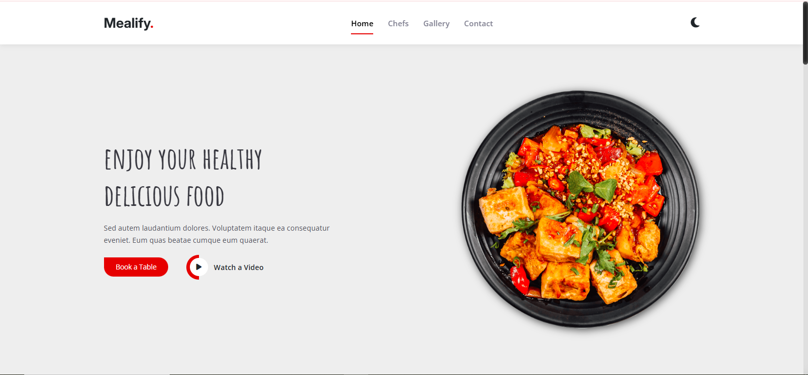
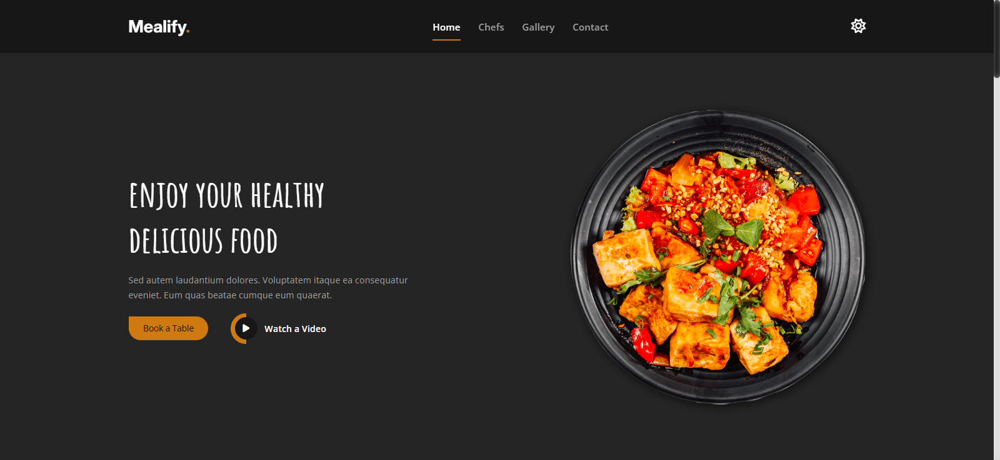
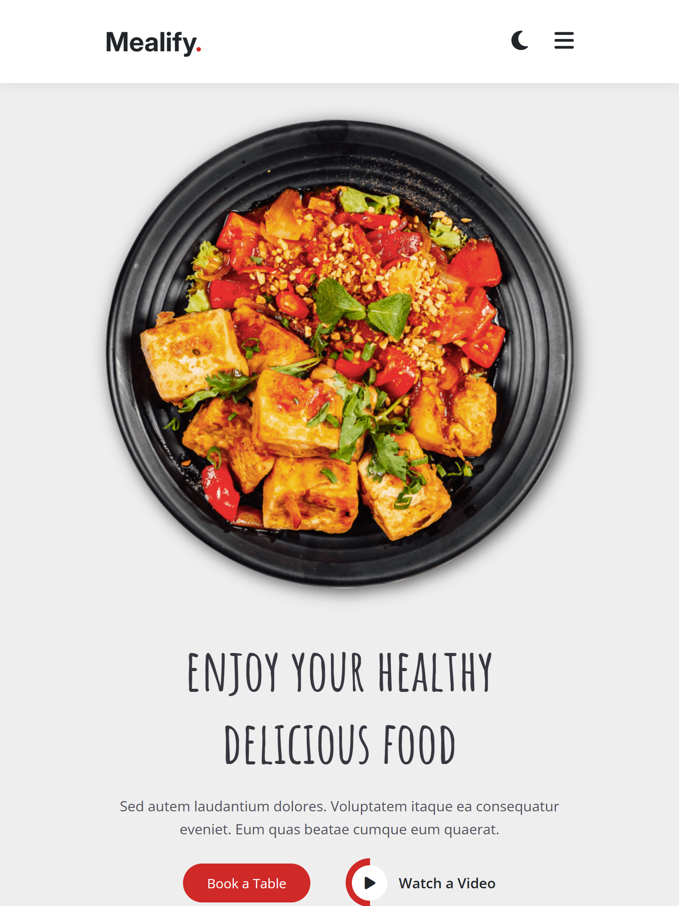
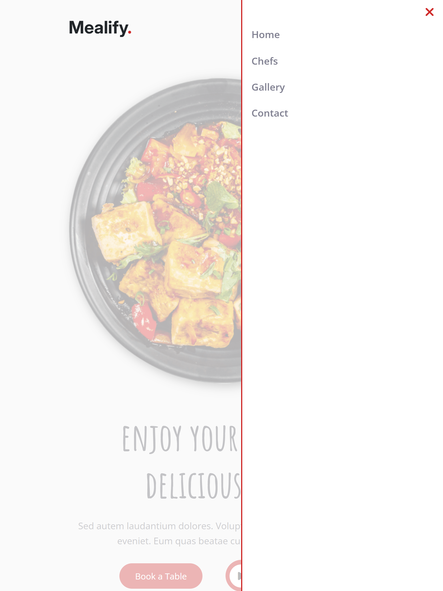

# 🍽️ Mealify  

**Mealify** is a modern and responsive practice project focused on mastering **Flexbox layouts**, **responsive design**, and **clean code structure**. It’s designed to showcase best practices in front-end development while keeping the UI simple, adaptable, and user-friendly.  

---

## ✨ Features  
- 🖥️ **Flexbox Layouts** → Well-structured and adaptive page design  
- 📱 **Responsive Design** → Smooth display across desktops, tablets, and mobiles  
- 🌗 **Mode Switching** → Toggle between different modes (e.g., dark/light)  
- 🧹 **Clean Code** → Organized, readable, and maintainable codebase  

---

## 🛠️ Built With  
- **HTML5**  
- **CSS3** (Flexbox, Responsive techniques)  

---

## 📸 Preview  
## 🌞 Light Theme


## 🌙 Dark Theme


## 📱 Responsive Navbar


## 📱 Responsive Sidebar



## 🚀 Getting Started  

To run locally:  

```bash
# Clone the repository
git clone https://github.com/dohahehe/Mealify.git

# Open the index.html file in your browser
